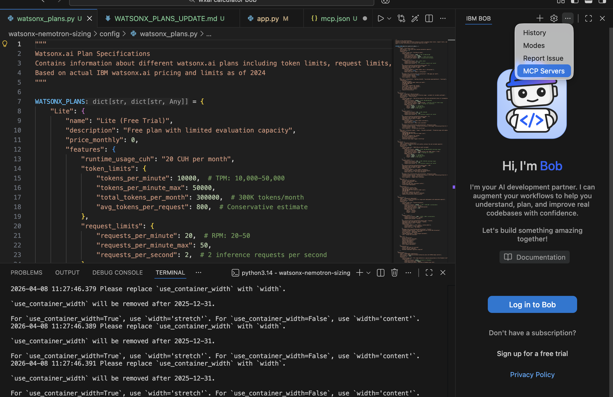
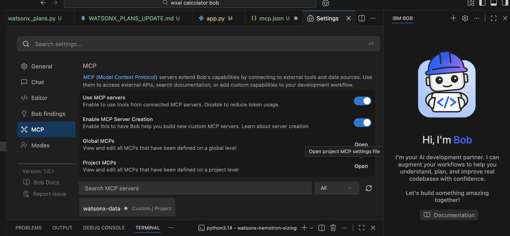
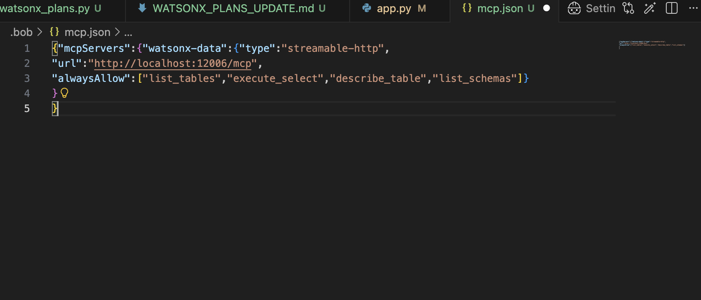
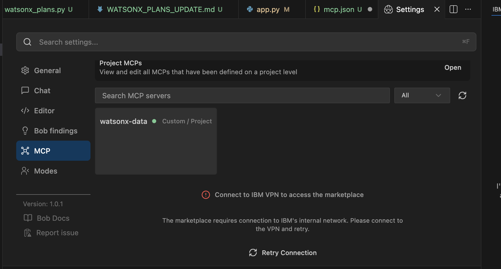

# Adding a Local Docker MCP Server to Bob

This guide walks through connecting a locally running MCP server (inside a Docker container) to **Bob**, the IBM AI development partner extension for VS Code.

---

## Prerequisites

- Bob extension installed in VS Code
- Your MCP server running inside a Docker container, exposed on a local port (e.g., `http://localhost:12006/mcp`)

---

## Step 1: Open Bob's MCP Settings

Click the **Bob icon** in the VS Code activity bar to open the Bob panel. In the top-right corner of the panel, click the **`...` menu** and select **MCP Servers**.



This opens Bob's **Settings** page with the MCP configuration section.

---

## Step 2: Navigate to the MCP Section

In the Settings panel, click **MCP** in the left sidebar. You will see:

- **Global MCPs** — MCP servers defined at the global (user) level
- **Project MCPs** — MCP servers scoped to the current project

To add a server for this project only, click **Open** next to **Project MCPs**. This opens the project-level `mcp.json` file (located at `.bob/mcp.json` in your workspace root).



> **Tip:** Use **Project MCPs** when the MCP server is specific to a single workspace (e.g., a watsonx.data instance tied to this project). Use **Global MCPs** for servers you want available across all projects.

---

## Step 3: Edit `mcp.json`

The `.bob/mcp.json` file controls which MCP servers Bob connects to. Add your Docker-hosted MCP server using the `streamable-http` transport type and the localhost URL where the container is listening.

**Example `mcp.json`:**

```jsonc
{
  "mcpServers": {
    "watsonx-data": {
      "type": "streamable-http",
      "url": "http://localhost:12006/mcp",
      "alwaysAllow": [
        "list_tables",
        "execute_select",
        "describe_table",
        "list_schemas"
      ]
    }
  }
}
```



### Key fields

| Field | Description |
|---|---|
| `mcpServers` | Top-level object; each key is a name you choose for the server |
| `type` | Transport protocol — use `streamable-http` for HTTP-based MCP servers |
| `url` | The URL where your Docker container exposes the MCP endpoint |
| `alwaysAllow` | List of tool names Bob can call without prompting for confirmation |

---

## Step 4: Verify the Connection

After saving `mcp.json`, return to **Settings → MCP**. Your server should appear in the MCP server list with a **green dot**, indicating it is connected and healthy.



If the dot is red or the server does not appear:

1. Confirm your Docker container is running and the port is correctly mapped (e.g., `docker ps` to verify).
2. Check that the `url` in `mcp.json` matches the host port binding.
3. Click the **refresh icon** next to the MCP server list to retry the connection.

---

## Notes

- The `alwaysAllow` list bypasses the confirmation prompt for the listed tools. Only include tools you trust Bob to call automatically.
- If you need the MCP server available across all your projects, add the same configuration under **Global MCPs** instead.
- Bob must be restarted (or the MCP list refreshed) after editing `mcp.json` for changes to take effect.
